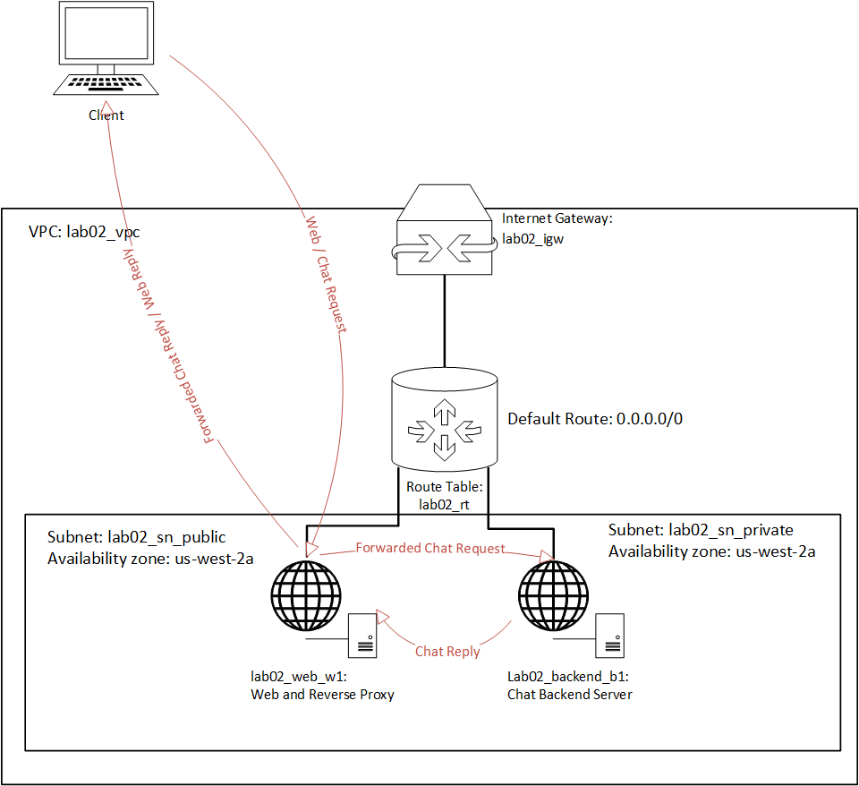

# Lab 02 

# Task 2: Create SSH Key Pair and Import Public Key to AWS

Using any combination of `ssh-keygen`and `awscli` commands, create an SSH key pair and upload the public key to AWS.

- Key Comment / Key Pair Name: `acit_4640_lab02_key`
- Key Type: `ed25519`
- key file name: `acit_4640_lab02_key`
- Passphrase: none
- Key Format: `pem`

# Task 3: Create Basic Infrastructure with Terraform

Using Terraform you will be provisioning the resources to host a chat application.
The application is comprised of a web server (lab02_web_w1)
that also acts as a reverse proxy, and a backend chat server (lab02_backend_b1).

The web server will serve the application html and javascript files.
It will also forward chat requests initiated by web clients to and from the backend server. The web server will listen on port 80.

The backend server will handle the chat requests and log the chat messages to a file.
It will listen on port 80 .

- VPC: `lab02_vpc`
  - Enable DNS Hostnames

- Internet Gateway: `lab02_igw`
- Route Table: `lab02_rt`
- Subnets:
  - `lab02_sn_public`
  - `exam_s03_sn_private`
- Security Groups:
  - `lab02_public`
    - allows both Web and SSH traffic in from the internet.
    - allow all traffic in from VPC
    - allows all traffic out to the internet.
    - allow all traffic out to VPC
  - `lab02_private`
    - allows SSH traffic in from the internet.
    - allow all traffic in from VPC
    - allows all traffic out to the internet.
    - allow all traffic out to VPC
- An EC2 instance `lab02_web_w1`\
  - Assign Public IP
  - intended to act as a web and reverse proxy server
  - connected to the `lab02_sn_public` subnet.
  - Tags
    - `Name`: `lab02_web_w01`
    - `Server_Role`: `web`
    - `Project`: `lab02 `
- An EC2 instance `lab02_backend_b1`
  - intended to act as chat backend server
  - connected to the `lab02_sn_private` subnet.
  - Tags
    - `Name`: `lab02_backend_b1`
    - `Server_Role`: `backend`
    - `Project`: `lab02 `
- A AWS key pair `acit_4640_lab02_key`

# Task 4: Verify Infrastructure 
Demonstrate that you can connect to the web server and the backend server from your local machine using ssh.

Use `nmap` to verify that the both servers are accessible from the correct ports.